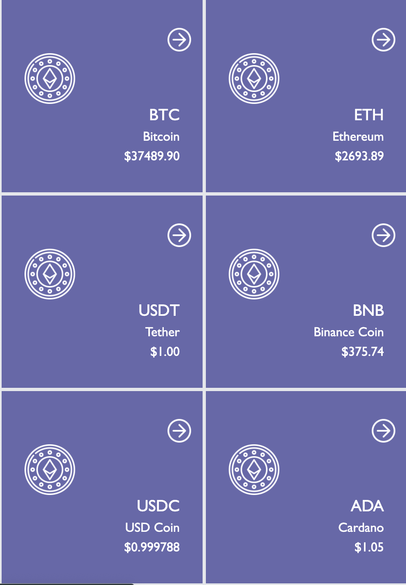
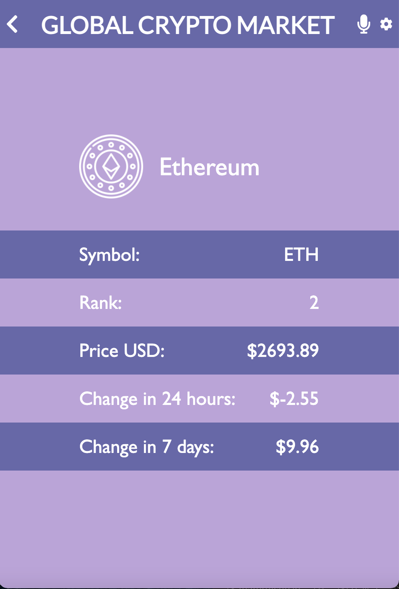

<h1>Crypto Currency Daily Stats</h1>

This web application shows the current exchange rate of 100 major crypto currencies. The application uses live data from the Coinlore API and will allow users to:

<ul>
  <li>See the current exchange rates for 100 major crypto currencies</li>
  <li>See details for each currency</li>
</ul>

 

 

 

 

<h2>Live Demo</h2>

<a href="https://inspiring-johnson-ba0a03.netlify.app/">View Live Link</a> 
<a href="https://www.loom.com/share/ef165aafac2e442c9717af83e03473bd">View Video Demo</a>

 

<h2>🧩 Built With</h2>

React.js 
Redux 
TailwindCSS 

This project was bootstrapped with [Create React App](https://github.com/facebook/create-react-app).

 

<h2>📚 Getting Started</h2>

To get a local copy up and running follow these simple example steps.

<h2>Prerequisites</h2>

For this project you don't need any aditional tools to run it.
Be sure to have git set up on your local machine. If you are unfamiliar with the necessary steps, please find a step-by-step guide <a href="https://git-scm.com/book/en/v2/Getting-Started-First-Time-Git-Setup" rel="noopener noreferrer">here</a>

<h2>Setup</h2>

Fork a copy to your repository and clone it locally: `
 $ git clone https://github.com/Anjacodes/React_Capstone_Project.git
$ cd React_Capstone_Project`

<h2>Install</h2>

Run `npm install` from your terminal window

<h2>Usage</h2>

You can now edit the code in your favorite Code Editor or view it in your browser.

<h2>Deployment</h2>

### `npm start`

Runs the app in the development mode.\
Open [http://localhost:3000](http://localhost:3000) to view it in your browser.

The page will reload when you make changes.\
You may also see any lint errors in the console.

### `npm run build`

Builds the app for production to the `build` folder.\
It correctly bundles React in production mode and optimizes the build for the best performance.

The build is minified and the filenames include the hashes.\
Your app is ready to be deployed!

See the section about [deployment](https://facebook.github.io/create-react-app/docs/deployment) for more information.

<h3>Authors</h3>

👤 Anja

GitHub: <a href="https://github.com/Anjacodes" rel="noopener noreferrer">@Anjacodes</a> 
Twitter: <a href="https://twitter.com/Anja_Schmidt7" rel="noopener noreferrer">@Anja_Schmidt7</a> 
LinkedIn: <a href="https://www.linkedin.com/in/anja-schmidt7/" rel="noopener noreferrer">Anja Schmidt</a> 

<h2>🤝 Contributing</h2>

Contributions, issues, and feature requests are welcome!

Feel free to check the <a href="https://github.com/microverseinc/readme-template/issues" rel="noopener noreferrer">issues page</a>.

<h2>Show your support</h2>

Give a ⭐️ if you like this project!

<!-- <h2>Acknowledgments</h2>

Thank you Microverse for your guidance in making a great portfolio for myself! -->

<h2>📝 License</h2>

This project is <a href="https://github.com/microverseinc/readme-template/blob/master/MIT.md" rel="noopener noreferrer">MIT</a> licensed.

Copyright (c) 2022 Anja Schmidt

